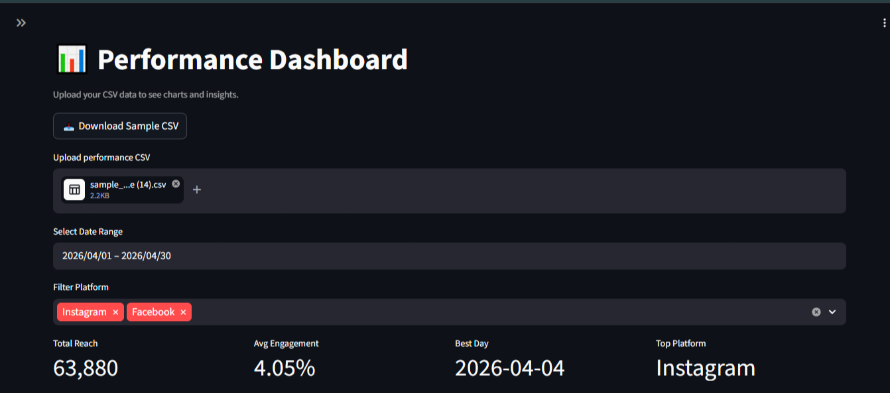
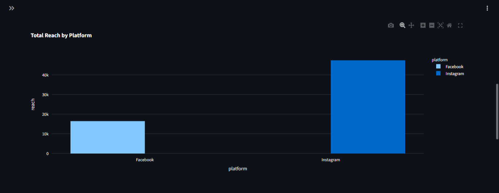
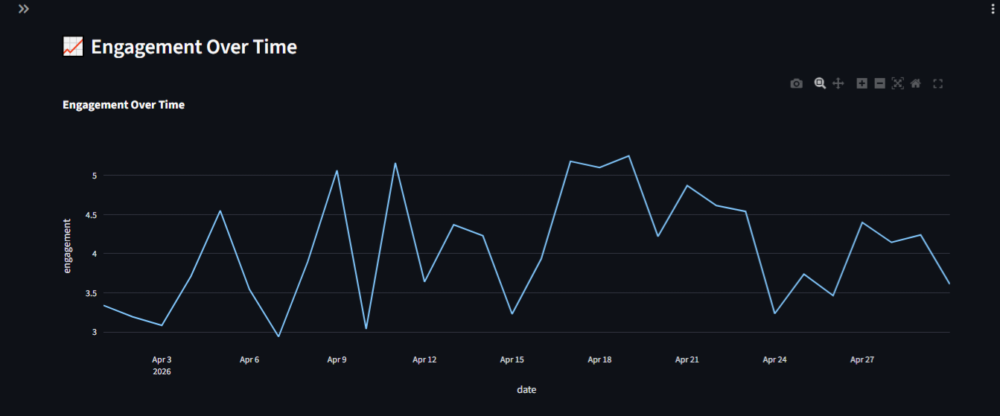
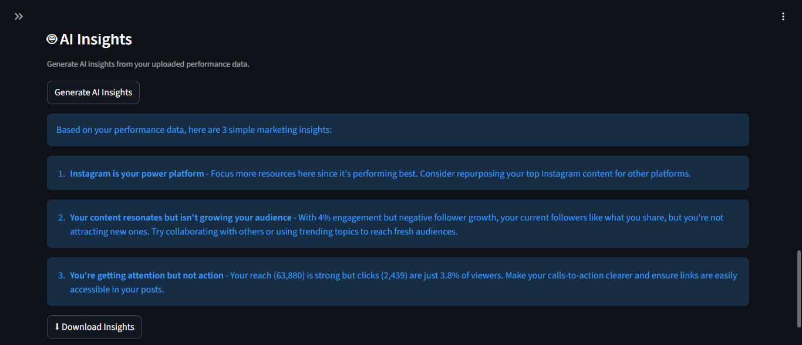

# AI Social Media Strategy Tool - Performance Dashboard & Data Pipeline

Built during AI Development Internship at Auxoweb Studio (April-May 2026)

## My Module: Module 3 - Performance Dashboard & Data Pipeline

This module processes social media performance data and converts it into clear visual insights using charts, comparisons, and AI-generated observations. It helps digital marketing teams quickly understand campaign performance without manual spreadsheet analysis.

---

## Tech Stack

- Python
- Streamlit
- Pandas
- Claude API (claude-sonnet-4-5)
- Git & GitHub

---

## Features

- Upload and process CSV marketing data
- Interactive charts for reach, engagement, and follower growth
- Month-on-month performance comparison
- AI-generated plain-English insights
- Platform and date filtering

---

## Screenshots

---

## What I Learned

- API integration and prompt engineering
- Data visualization using Streamlit
- CSV data processing with Pandas
- Dashboard UI development
- GitHub workflow and deployment

---

Built for: Auxoweb Studio, Brno, Czech Republic
